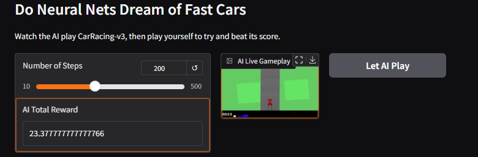
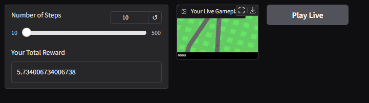

# VAE-MDNRNN World Model in CarRacing-v3: Exploring AI's Decision-Making

World models, incorporating Variational Autoencoders (VAE) and Mixture Density Recurrent Neural Networks (MDNRNN), are a groundbreaking approach to reinforcement learning and simulation-based AI. By enabling agents to 'imagine' environments, they open the door to efficient training, adaptability, and decision-making in complex scenarios.

This project showcases the application of a VAE-MDNRNN-powered world model in a simulated racing environment, CarRacing-v3, where an AI agent 'dreams' the racing track to optimize its performance. Beyond gaming, this architecture is widely applicable in domains such as:

- **Healthcare:** Predicting patient outcomes by modeling disease progression.
- **Autonomous Driving:** Enhancing vehicle safety with robust decision-making in simulated environments.
- **Robotics:** Simulating real-world tasks for cost-effective robot training.
- **Finance:** Forecasting market trends using imagined trajectories of financial indicators.
- **Marketing:** Optimizing ad placements by modeling customer behavior.

This project is a stepping stone into the potential of world models, demonstrating their effectiveness and how they can be applied to real-world challenges.

---

## Features
- **AI Gameplay:** Watch the AI play the CarRacing-v3 environment live and achieve a score.
- **Human Gameplay (WIP):** Compete against the AI using manual controls.
- **Interactive Interface:** Built using Gradio for an easy-to-use web interface.

---

## Screenshots
### AI Playing

### Human Playing

---

## Challenges Faced
- Implementing real-time WASD controls for human gameplay in a browser-based interface remains a work-in-progress.
- Rendering live frames during gameplay required creative solutions and debugging.
- Gradio's current limitations for handling live keypress interactions posed technical challenges.

---

# How to Use

1. **AI Play:**

   - Adjust the number of steps using the slider.
   - Click "Let AI Play" to watch the AI in action.
   - View the AI's score and gameplay in the interface.

2. **Human Play:**

   - Use the WASD buttons (or sliders for alternative control) to play the game.
   - Compete to beat the AI's score.

---

## Technical Details

### Key Libraries

- **Gradio:** Used to build the interactive web interface.
- **Gymnasium:** Provides the CarRacing-v3 environment for AI and human gameplay.
- **NumPy:** Utilized for numerical computations and action arrays.
- **Pillow:** Used for handling images within the interface.
- **Keyboard (WIP):** Planned for live keypress controls during human gameplay.

### AI Gameplay

The AI uses a predefined action sequence:

- **Action:** Full throttle, no steering, no brakes.
- The AI's gameplay is streamed live, frame-by-frame.

### Human Gameplay

The current implementation aims to provide WASD controls:

- **W:** Accelerate (Gas)
- **A:** Steer Left
- **S:** Brake
- **D:** Steer Right
- Keypress handling for live gameplay is under development.

---

## Known Issues

- **WASD Controls:** Real-time keypress inputs are currently experimental and may not function as intended.
- **Human Gameplay:** The last frame of gameplay is rendered instead of live streaming the game.
- **Interface Scaling:** Gameplay frames may appear small and require further optimization for better visibility.

---

## Future Improvements

- Implement seamless live WASD controls for human gameplay.
- Optimize frame rendering to improve the user experience.
- Add functionality to save gameplay recordings for both AI and human participants.

---

## Acknowledgments

Special thanks to the open-source libraries and tools that made this project possible:

- [Gradio](https://gradio.app/)
- [Gymnasium](https://www.gymlibrary.dev/)
- [Python](https://www.python.org/)

---

## License

This project is licensed under the MIT License. See the LICENSE file for details.

---

## Contact

If you have any questions, feel free to reach out via [LinkedIn](https://www.linkedin.com/your-profile) or open an issue in the repository.
